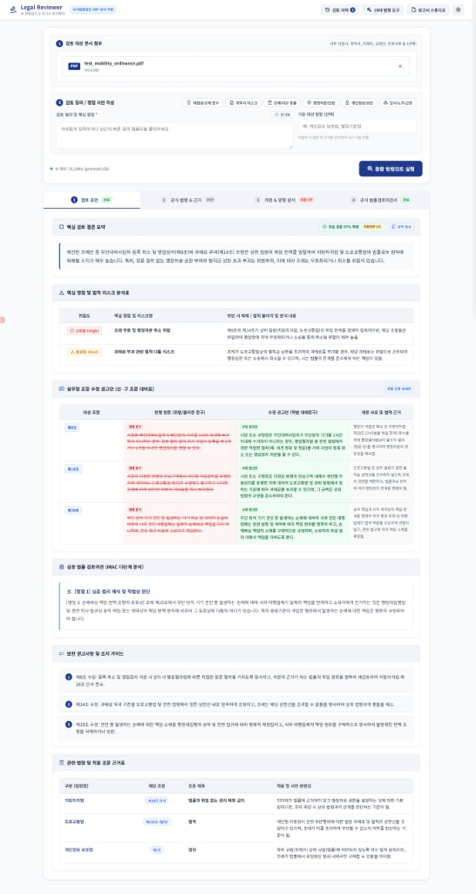
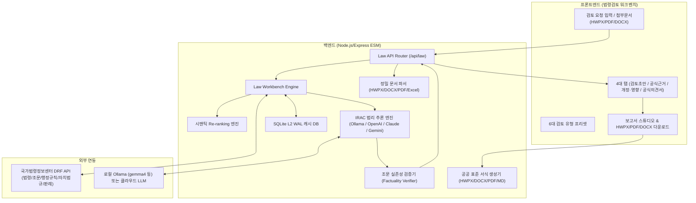

# Legal Reviewer (지능형 AI 법령검토 & 공공서식 보고서 생성 워크벤치)

**Legal Reviewer**는 국가법령정보센터(law.go.kr) 공식 Open API, 대법원 판례, 법제처 유권해석례, 3단계 연쇄 법령 체계(모법-시행령-시행규칙) 연동과 로컬/클라우드 LLM(Ollama, OpenAI, Anthropic, Gemini)을 결합하여, 전문 법률 검토 및 공공서식 보고서(HWPX, PDF, DOCX) 생성을 자동화하는 **독립형 지능형 AI 법률 검토 워크벤치 솔루션**입니다.

---



---

## 목차
1. [주요 핵심 기능](#주요-핵심-기능)
2. [4대 탭 메뉴 구조 및 작동 메커니즘](#4대-탭-메뉴-구조-및-작동-메커니즘)
3. [성능 고도화 5대 핵심 기술](#성능-고도화-5대-핵심-기술)
4. [시스템 아키텍처](#시스템-아키텍처)
5. [설치 및 실행 가이드](#설치-및-실행-가이드)
6. [벤치마크 및 테스트](#벤치마크-및-테스트)
7. [법령 도구 목록](#법령-도구-목록)
8. [프로젝트 디렉토리 구조](#프로젝트-디렉토리-구조)

---

## 주요 핵심 기능

### 1. 6대 법률 검토 프리셋
- **적법성/규제 준수**: 신규 사업 기획, 행정 절차, 인허가 요건 및 상위 법령 위반 여부 검토
- **계약서 리스크 분석**: 독소 조항, 불공정 약관, 손해배상 및 해지 조항의 법률적 효력 및 신구 조문 수정 대안 제시
- **조례/내규 상위법 충돌**: 지자체 조례안 및 공공기관 내규의 법률유보원칙 및 모법 위임 한계 일탈 여부 검토
- **행정처분/민원 대응**: 영업정지, 과태료, 시정명령 등 행정처분의 절차적/실체적 적법성 및 행정심판/소송 방어 전략 검토
- **개인정보/보안 규제**: 개인정보 수집·이용 동의, 제3자 제공, 안전성확보조치 준수 여부 검토
- **인사/노무/근로기준**: 근로계약, 취업규칙, 해고/징계, 주52시간제, 포괄임금제 등 노동관계법 검토

### 2. 브라우저 IndexedDB 영구 검토 이력 관리
- **영구 보존 (Persistent Storage API)**: 검토를 수행할 때마다 브라우저 로컬 저장소인 `IndexedDB(LegalReviewDB)`에 전체 분석 데이터 스냅샷이 영구 기록됩니다. 브라우저를 닫거나 컴퓨터를 재부팅해도 안전하게 보존됩니다.
- **원클릭 복원**: 우측 검토 이력 드로어에서 **[불러오기]** 버튼을 클릭하면 4대 탭 화면 전체를 즉시 복원합니다.

### 3. 멀티포맷 첨부문서 정밀 파싱 및 공공서식 보고서 생성
- **지원 입력 문서**: HWPX, PDF, DOCX, XLSX, CSV, TXT (표/Table 및 조항 계층 구조 완벽 복원)
- **지원 출력 보고서**:
  - **HWPX**: 한컴오피스 2014~2024 완벽 호환 표준 OCF/OWPML 바이너리 패키징 (신구 조문 대비표 및 결재선 내장)
  - **PDF**: 인쇄용 공문서 레이아웃 및 한글 폰트 적용
  - **DOCX**: MS Word OpenXML 서식
  - **Markdown**: 텍스트 편집용 마크다운

---

## 4대 탭 메뉴 구조 및 작동 메커니즘

```text
[사용자 입력 (질의 / 첨부문서 / 6대 프리셋)]
                     │
                     ▼
┌───────────────────────────────────────────────────────────┐
│ 1. 법령 데이터 수집, 계층 청킹 & Re-ranking 엔진          │
│    - 국가법령정보센터 DRF API / 판례 / 해석례 실시간 수집 │
│    - legalDocChunker(조항 계층 분할 및 위험 조항 태깅)    │
│    - 시맨틱 Re-ranking (Top 3 판례, Top 2 해석례 엄선)   │
└────────────────────────────┬──────────────────────────────┘
                             │
                             ▼
┌───────────────────────────────────────────────────────────┐
│ 2. 20년 베테랑 IRAC 추론 & 조문 실존성 검증 엔진          │
│    - Issue(쟁점) ➔ Rule(규범) ➔ App(포섭) ➔ Conc(결론)    │
│    - factualityVerifier (조문 실존성 전수 검증/오인용 교정)│
│    - Redline Diff (신구 조문 대비표 실무 대안 자동 생성)  │
└────────────────────────────┬──────────────────────────────┘
                             │
         ┌───────────────────┼───────────────────┬───────────────────┐
         ▼                   ▼                   ▼                   ▼
┌─────────────────┐ ┌─────────────────┐ ┌─────────────────┐ ┌─────────────────┐
│  [1. 검토 초안] │ │ [2. 법령 & 근거]│ │ [3. 개정·영향]  │ │[4. 공식의견서(결론)]
│  - 조문검증 뱃지│ │ - Re-rank 판례  │ │ - 내부 위험 조항│ │ - 완성형 공문서뷰│
│  - IRAC 분석표  │ │ - 유권해석례    │ │ - 4열 대조표    │ │ - 빠른 HWPX/PDF │
│  - Redline 대비표│ │ - 3단계 연쇄체계│ │ - 법령 개정연혁 │ │ - 스튜디오 에디터│
└─────────────────┘ └─────────────────┘ └─────────────────┘ └─────────────────┘
```

### 탭 1: [1. 검토 초안]
- **조문 실존성 검증 뱃지**: 수집된 공식 조문 및 법령 API와 대조한 인용 검증 비율(검증 건수/전체 인용 건수)을 표시합니다. 대조 기준을 확보하지 못했거나 목업 데이터로 동작 중이면 숫자 대신 **측정 불가**로 표시되며, 검증되지 않은 인용은 **미검증**으로 별도 표기됩니다.
- **핵심 요약 및 IRAC 심층 법률 검토의견**: 쟁점, 적용 규범, 구체적 사실관계 포섭, 결론
- **신·구 조문 대비표 (Redline Diff)**: 독소/위법 조항에 대한 `[현행 문구]` vs `[수정 권고안]` vs `[개정 사유]` 대조 테이블
- **보완 권고사항 체크리스트 & 적용 조문 근거표**

### 탭 2: [2. 공식 법령 & 근거]
- **시맨틱 Re-ranked 판례 및 유권해석례**: 사안 적합도 점수(별점/점수) 및 매칭 사유가 포함된 판결요지 전문 팝업 카드
- **3단계 연쇄 법령 체계 (Cascading Hierarchy)**: 모법(법률) ➔ 시행령 ➔ 시행규칙 ➔ 행정규칙 자동 연결 구조
- **행정규칙 및 자치법규(조례) 근거 카드**

### 탭 3: [3. 개정 & 영향 분석]
- **1. 내부 문서 쟁점 및 위험 조항 영향도 분석**: 사전동의 생략, 음성녹음, 면책 등 독소조항 자동 감지 및 파급 효과 분석
- **2. 조문 인용 충돌 및 현행 법령 적합성 대조표**: 4열 표준 테이블 (인용 조문 / 적합성 판정 / 공식 조문 내용 / 실무 조치 가이드)
- **3. 소관 법령 최근 개정 연혁 및 시행 타임라인**: 최근 공포일자, 공포번호, 시행일자, 소관 부처 히스토리

### 탭 4: [4. 공식 법률검토의견서]
- 실무 및 결재용으로 즉시 활용 가능한 **공공 표준 서식 보고서 뷰어**
- HWPX, PDF, DOCX 원클릭 다운로드 및 **[보고서 스튜디오]** 심층 편집 연동

---

## 성능 고도화 5대 핵심 기술

1. **문서 정밀 구조화 (Document Engine)**
   - HWPX `<hp:tbl>` 및 DOCX `<table>` 마크다운 표 변환 복원
   - `legalDocChunker`: `제O조`, `①항`, `1.호`, `가.목` 계층 트리 청킹 및 위험 조항 태깅
   - `contextOptimizer`: 50~100페이지 대용량 문서 쟁점 조항 우선 슬라이싱
2. **하이브리드 검색 & 시맨틱 Re-ranking (Retrieval Engine)**
   - 60+ 법률 도메인 실무 키워드 및 다중 질의어 사전 확장 (`lawTermKb.js`)
   - 3단계 체계적 연쇄 검색 (`cascadingRetriever.js`) — *현재 시행령 조회가 동작하지 않습니다 (단위 테스트 실패 중).*
   - 시맨틱 Re-ranking 알고리즘 (조문 일치 45% + 쟁점 포섭 40% + 대법원/전합 권위 15%) ➔ **Top 3 판례, Top 2 해석례 엄선**
3. **20년 베테랑 IRAC 추론 & 환각 방지 (Reasoning & Quality)**
   - 엄격한 IRAC 4단계 법리 추론 및 Redline Diff 신구 조문 대비표 자동 생성
   - `factualityVerifier`: LLM 인용 조문의 실존성을 공식 조문과 교차 검증하고, 확인되지 않은 인용을 `UNVERIFIED`로 표시합니다. 존재하지 않는 조문을 임의의 다른 조문으로 치환하지 않습니다.
4. **UI 렌더링 & 공문서 정형화 출력**
   - 램프 오프/온 뱃지 라이프사이클 관리, 절제된 Material Symbols 아이콘 적용
   - HWPX/PDF/DOCX 공문서 출력 시 신구 조문 대비표 및 조문 검증 결과 내장
5. **2단계 고속 캐시 최적화**
   - 인메모리 L1 + SQLite L2 (WAL 모드) 2계층 캐시로 반복 질의 0.5초 이내 고속 응답

---

## 시스템 아키텍처



---

## 설치 및 실행 가이드

### 1. 환경 요구사항
- **Node.js 22.0.0 이상** (`node:sqlite` 내장 모듈을 사용합니다. Node 18/20에서는 기동되지 않습니다.)
- npm 9.0.0 이상
- (선택) 로컬 LLM 구동 시: [Ollama](https://ollama.ai)

> **LAW_OC 미설정 시 동작**: 국가법령정보센터 API 인증(`LAW_OC`)이 없으면 서버는
> 목업 샘플 데이터로 동작합니다. 이 경우 화면 상단에 경고 배너가 표시되며,
> 결과에 포함된 조문·판례는 **공식 법령 데이터가 아니므로 인용할 수 없습니다.**

### 2. 설치 및 실행
```bash
# 1. 의존성 설치
npm install

# 2. 환경 변수 설정 (.env 파일 생성)
# LAW_OC는 국가법령정보공동활용(open.law.go.kr)에서 발급받은 본인 계정 ID를 입력합니다.
cp .env.example .env

# 3. 서버 실행
npm start
# 또는 개발 모드: npm run dev
```

브라우저에서 `http://localhost:3000`으로 접속하여 사용합니다.

---

## 벤치마크 및 테스트

### 측정 상태 (2026-09-20 기준)

**현재 공개 가능한 벤치마크 수치는 없습니다.** 유효한 측정에는 국가법령정보센터
API 인증(`LAW_OC`)과 구성된 LLM 엔진이 모두 필요하며, 두 조건을 갖춘 환경에서의
측정이 아직 수행되지 않았습니다.

이전 버전의 README에는 "조문 인용 정확도 99.0%, 판례 적합도 85.9점, IRAC 충족률
100%, 평균 484ms, 20건 전수 성공"이라는 표가 실려 있었습니다. 이 수치는 철회합니다.
해당 측정은 `LAW_OC` 미설정(목업 데이터) + `rule_based` 폴백 엔진 상태에서
수행된 것으로, 네트워크 호출도 LLM 호출도 없이 20건이 0.01초에 완료되었습니다.
또한 지표 산식 자체가 자기충족적이었습니다.

- `citationConfidence || 95`, `relevanceScore || 85` — 값이 없으면 합격점을 기본값으로 채움
- IRAC 점수를 하드코딩된 고정 문자열에 대한 부분일치로 계산 → 항상 100%
- Redline 건수를 키워드 분기의 하드코딩 상수로 계산 → 항상 1건 이상
- 조문 인용 신뢰도가 `Math.min(Math.max(x, 80), 99)`로 묶여 80% 미만이 나올 수 없었음

동일한 코드 경로를 정답 대조 방식으로 재측정한 결과는 다음과 같습니다
(`provider=rule_based`, `LAW_OC` 미설정):

| 지표 | 기존 표기 | 재측정 |
|---|---:|---:|
| 총 검증 | 20건 전수 성공 | PASS 0건 / 실격 20건 |
| 조문 인용 정확도 | 99.0% | 33.3% (20건 중 4건만 측정 가능) |
| 정답 조문 재현율 | (미측정) | 41.5% |
| 최상위 판례 적합도 | 85.9점 | 42.5점 |
| Redline 수정안 | 29개 조항 | 0건 |
| 평균 응답 시간 | 484ms | 1ms |

"실격"은 목업 데이터 또는 폴백 엔진으로 산출되어 시스템 성능을 나타내지 않는
결과를 뜻합니다. 현재 하네스는 이 경우 종료 코드 1을 반환합니다.

### 벤치마크 실행

```bash
# 환경설정(.env)의 LLM_PROVIDER 기준
node test/benchmark/runBenchmark.js

# 엔진 지정
BENCH_PROVIDER=ollama node test/benchmark/runBenchmark.js

# 폴백 결과까지 집계에 포함 (진단용)
BENCH_ALLOW_FALLBACK=1 node test/benchmark/runBenchmark.js
```

하네스는 데이터셋(`test/benchmark/benchmarkDataset.js`)의 `targetLaw`와
`expectedArticles`를 정답으로 삼아 다음을 채점합니다.

- **기준 법령 일치**: 시스템이 실제로 조회한 법령이 기대 법령과 같은가
- **조문 인용 정확도 / 재현율**: 인용 조문이 정답 조문 집합과 얼마나 겹치는가
- **판례 적합도**: Re-ranker 점수 (값이 없으면 기본값을 채우지 않고 '측정 불가')
- **Redline 수정안**: 탐지 건수가 아니라 실제 수정 문구가 작성된 건수

측정 조건(엔진, `LAW_OC` 설정 여부)은 보고서 상단에 항상 출력됩니다.

### 단위 테스트

```bash
npm test
```

현재 **17건 중 16건 통과, 1건 실패**입니다.
실패 항목은 `3단계 체계적 연쇄 검색 (cascadingRetriever)` — 시행령 조회가
`null`을 반환합니다. (기존부터 실패 상태였습니다.)

---

## 법령 도구 목록

실행 가능한 도구 17종과 이를 구동하는 인프라 모듈 2종(`toolRunner`, `toolRegistry`)입니다.

| 도구명 | 설명 |
|---|---|
| `searchLaw` | 키워드/법령명 기반 법령 목록 검색 |
| `searchAiLaw` | 자연어 질의 기반 AI 스마트 법령 검색 |
| `articleDetail` | 법령 ID 및 조문 번호 기준 상세 조문 조회 |
| `articleAt` | 특정 시행일자 기준 과거/미래 조문 조회 |
| `articleDiff` | 개정 전·후 조문 비교 및 변경사항 하이라이트 |
| `impactMap` | 내부 문서 조문 인용 충돌 및 현행 법령 적합성 대조 분석 |
| `precedents` | 대법원 및 하급심 판례 검색 |
| `interpretations` | 법제처 유권해석례 검색 |
| `decisions` | 행정심판 및 특별행정심판 재결례 검색 |
| `adminRules` | 소관 부처 훈령, 예규, 고시 검색 |
| `linkedOrdinances` | 법령 위임 지자체 조례 및 자치법규 검색 |
| `delegatedLaws` | 모법 위임 하위 시행령/시행규칙/고시 추적 |
| `lawStructure` | 법령 전체 편-장-절-조 계층 트리 구조 조회 |
| `lawHistory` | 법령 제정/개정 연혁 조회 — **제약**: 현행 법령 목록(`target=law`)을 연혁으로 간주합니다. 실제 연혁 API(`target=lsHistory`)를 사용하지 않아 과거 개정 이력을 반환하지 못합니다. |
| `timeTravel` | 특정 시점 기준 유효 법령 조회 — **제약**: 시행일 법령 API(`target=eflaw`)를 사용하지 않아 현행 버전만 반환합니다. 과거 시점 재현이 동작하지 않습니다. |
| `annexes` | 법령 별표 및 서식 조회 |
| `verifyCitations` | 인용 조문 실존성 검증 (미확인 인용은 `UNVERIFIED`로 표시) |
| `toolRunner` | *(인프라)* 도구 실행기 |
| `toolRegistry` | *(인프라)* 도구 카탈로그 메타데이터 |

---

## 프로젝트 디렉토리 구조

```text
legal_review/
├── .env                          # 환경 설정 (LAW_OC, LLM_PROVIDER 등)
├── package.json                  # 프로젝트 의존성 및 스크립트
├── README.md                     # 프로젝트 종합 안내서
├── public/                       # 프론트엔드 정적 파일
│   ├── index.html                # 메인 워크벤치 UI (4대 탭 레이아웃)
│   ├── css/
│   │   ├── main.css              # 디자인 시스템 토큰 및 공통 레이아웃
│   │   ├── workbench.css         # 4대 탭, Redline 대비표, 대조표 스타일
│   │   └── studio.css            # 보고서 스튜디오 및 이력 드로어 스타일
│   └── js/
│       ├── app.js                # 메인 엔트리포인트 및 이벤트 바인딩
│       ├── lawWorkbench.js       # 4대 탭 렌더러 및 뱃지 상태 제어
│       ├── documentStudio.js     # 보고서 스튜디오 에디터
│       ├── documentViewer.js     # 조문/판례 전문 팝업 뷰어
│       ├── history.js            # 검토 이력 드로어 UI
│       ├── historyDb.js          # IndexedDB 영구 저장소
│       └── state.js              # 프론트엔드 전역 상태 관리
├── server/                       # 백엔드 모듈 (Node.js ESM)
│   ├── index.js                  # Express 서버 엔트리포인트
│   ├── env.js                    # 환경변수 로딩 및 유효성 검증
│   ├── rateLimit.js              # 요청 제한 미들웨어
│   ├── abort.js                  # 요청 취소 제어기
│   ├── export/
│   │   ├── exportFiles.js        # HWPX, PDF, DOCX, MD 표준 공문서 생성
│   │   └── exportStyles.js       # 공문서 스타일 정의
│   ├── law/
│   │   ├── lawApi.js             # Law API Express 라우터
│   │   ├── lawApiClient.js       # 국가법령정보센터 DRF 통신 클라이언트
│   │   ├── lawApiParser.js       # 법령 XML 파서
│   │   ├── decisionsApiClient.js # 판례/해석례 DRF 클라이언트
│   │   ├── decisionsApiParser.js # 판례/해석례 XML 파서
│   │   ├── cascadingRetriever.js # 모법-시행령-시행규칙 3단계 연쇄 검색
│   │   ├── reRanker.js           # 판례/해석례 시맨틱 Re-ranking 엔진
│   │   ├── factualityVerifier.js # 조문 실존성 검증 및 오인용 교정
│   │   ├── lawWorkbench.js       # 워크벤치 오케스트레이션 엔진
│   │   ├── lawWorkbenchReview.js # 20년 베테랑 IRAC 법리 추론 엔진
│   │   ├── lawTermKb.js          # 60+ 도메인 법률 전문용어 KB
│   │   ├── lawArticleRef.js      # 조문 정규식 추출기
│   │   ├── lawDiff.js            # 조문 신구 비교 엔진
│   │   ├── lawCache.js           # SQLite L2 캐시
│   │   └── tools/                # 19대 법령 분석 도구 모듈
│   └── parsers/
│       ├── index.js              # 통합 문서 파서
│       ├── hwpxParser.js         # HWPX 표(Table) 및 문단 파서
│       ├── docxParser.js         # DOCX 표(Table) 파서
│       ├── pdfParser.js          # PDF 텍스트 정규화 파서
│       ├── excelParser.js        # 엑셀 파서
│       ├── legalDocChunker.js    # 조항 계층 트리 청킹 & 위험 조항 태깅
│       └── contextOptimizer.js   # 대용량 문서 쟁점 중심 압축기
└── test/                         # 테스트 및 벤치마크 스위트
    ├── advancedParsers.test.js   # 고도화 파서 단위 테스트
    ├── export.test.js            # HWPX/PDF/DOCX 생성 테스트
    ├── lawApi.test.js            # 법령 API 클라이언트 테스트
    ├── lawHistory.test.js        # 법령 개정 이력 테스트
    ├── parsers.test.js           # 기본 문서 파서 테스트
    ├── reRankerAndVerifier.test.js # Re-ranking 및 환각 검증 테스트
    └── benchmark/
        ├── benchmarkDataset.js   # 20종 실무 법률 검토 벤치마크 데이터셋
        └── runBenchmark.js       # 벤치마크 실행 및 정량 지표 산출 엔진
```
