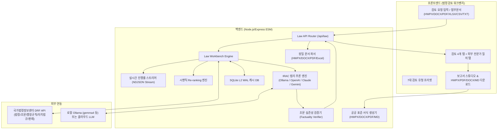

# 현재 구현·검증 상태

기준일: 2026-09-25. 이 문서는 Legal Reviewer 저장소의 현재 아키텍처, 실행 경로, 검증 상태 및 운영 판단을 통합 정리한 현황 문서이다.

---

## 1. 시스템 구성 및 아키텍처

### 핵심 모듈 매핑
- `server/law/lawWorkbench.js`: 공식 법령·판례·해석례 자료와 첨부문서를 결합하여 검토 컨텍스트 수집 및 파이프라인 제어.
- `server/law/lawWorkbenchReview.js`: 기본 단일 호출 검토, 단계형 위임, 조문 실존성 검증 및 폴백 처리.
- `server/reasoning/`: 단계형 검토(S0~S7). 근거 등록부(S0), 쟁점 추출(S1), 추가 조사(S2), 요건 분해(S3), 쟁점별 포섭(S4), 검증 원장(S6), 공백 산출(S7), 종합(S5).
- `server/law/progressReporter.js`: 검토 단계별 진행률 및 세부 상태를 NDJSON 스트림으로 실시간 전송.
- `server/law/manualLearning*.js`: 비식별 질의서 생성, 질문별 답변 카드 반입, 승인·지식 관리 및 재검토 루프.
- `server/law/tools/toolRegistry.js`: 17개 공식 법령 도구 및 인프라 실행 모듈.
- `public/js/`: 웹 워크벤치 4개 탭 및 학습 탭 UI, 검토 이력 관리(IndexedDB), 보고서 스튜디오.
- `server/export/`: 검토 결과와 제한 사항을 반영한 HWPX, PDF, DOCX, Markdown 표준 공문서 패키징.

---

## 2. 실행 경로

1. **기본 검토 경로 (Monolithic)**
   - 일반 API 검토의 기본 경로는 단일 호출(`monolithic`) 경로이다.
   - 단, 입력 문서 및 컨텍스트가 모델 예산을 초과하는 경우 토큰 안전을 위해 단계형 분할 검토(`staged`)를 먼저 시도한다.
2. **판례·해석례 선별 및 본문 수집**
   - 판례·해석례는 공식 검색 목록을 먼저 조회하고, LLM을 통해 묶음별 적합도를 선별한 뒤 통과·불확실 후보의 공식 본문만을 2단계로 정밀 조회한다.
   - 명시 인용 후보는 강제 보존하며, 목록 판정 자체는 법적 근거가 될 수 없으므로 공식 본문이 확인된 자료만 인용한다.
3. **토큰 안전 단계형 파이프라인 (Staged S0~S7)**
   - 근거 등록부(S0) → 쟁점 후보(S1) → 근거 조사(S2) → 요건 분해(S3) → 사실 포섭(S4) → 주장·근거 검증(S6) → 공백 산출(S7) → 종합(S5)으로 분리 실행.
   - 개별 호출 전 입력 토큰 예산을 엄격히 사전 검사하며, 예산 초과 시 조각별 분할·병합을 수행한다.
4. **외부 전문가 질의 (Manual Learning Loop)**
   - 소형 로컬 LLM이 스스로 판단하기 어려운 법리적 공백은 비식별 질의서로 자동 추출한다.
   - 사용자가 외부 전문가 또는 고성능 AI로부터 받은 답변을 반입하면 질문별 지식 카드로 승인하고, 기존 사건의 공식 근거 스냅샷과 결합하여 해당 요건만 정밀 재검토한다.
5. **UI 및 진행 현황**
   - 검토 초안, 공식 법령 & 근거, 개정 & 영향 분석, 공식 법률검토의견서의 4개 핵심 탭과 외부 전문가 질의 탭을 제공한다.
   - 단계형 결과의 쟁점·요건 표는 검토 초안 탭 내에서 구조화된 테이블로 직관적으로 표시된다.

---

## 3. 검증 상태 (2026-09-25 기준)

- **단위 테스트 (`npm test`)**: **231건 전수 통과, 0건 실패** (외부 통신 격리 픽스처 기반 회귀 검증).
  - 법령 API 파서, 다중 포맷 문서 파서, 조문 실존성 검증, 시맨틱 Re-ranking, 진행률 NDJSON 스트리밍, 시점 검토, 취소 제어 등 전 범위 포함.
- **실제 API 및 모델 검증 상태**:
  - 로컬 Ollama (`gemma4:e2b`) 환경에서 5개 실무 샘플(취업규칙, 용역계약, 영업정지, 개인정보, 사전컨설팅)에 대한 진단 측정을 수행함 ([단계형 비교 기록](audit/pipeline-comparison-2026-09-23.md)).
  - 단계형 검토는 파싱 5/5건 성공 및 규칙 기반 폴백 0건을 달성하였으나, 일부 샘플의 쟁점 생략 및 시간 지연이 관찰되어 현재 기본 검토는 단일 호출을 우선 유지하고 초과 시 단계형으로 전환하도록 운영 중이다.
  - 생략 쟁점은 공식 근거 공백(`MISSING_AUTHORITY`) 및 `HUMAN_REVIEW_REQUIRED` 게이트로 명시 처리되며, 사실 확인 공백은 사용자 확인 경로로 분리된다.

---

## 4. 운영 원칙 및 유의사항

1. **공식 근거 우선**: 국가법령정보센터 공식 인증(`LAW_OC`)이 없는 경우 목업 데이터를 공식 근거로 승인하지 않으며, `UNAVAILABLE` 상태와 검토 제한 사항을 명시한다.
2. **조문 실존성 교차 검증**: LLM이 생성한 조문 인용은 수집된 공식 조문과 대조하여 미확인 인용은 `UNVERIFIED`로 표기하며, 임의의 다른 조문으로 치환하지 않는다.
3. **과거 시점 검토**: 사건 발생일 또는 계약 체결일 기준 시점을 지정한 경우, 해당 일자에 시행 중이던 법령 버전을 수집하여 검토하며 부칙·경과조치에 대한 별도 확인 필요성을 경고로 명시한다.
