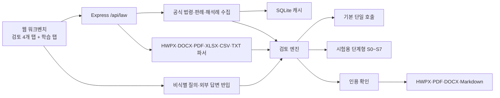

# Legal Reviewer 아키텍처와 구현 현황

기준일: 2026-09-23. 이 문서는 현재 코드의 구성과 검증 상태를 설명한다. 과거 문서의 `99.0%` 인용 정확도·`85.9` 판례 점수·`484ms` 평균 지연·`20건 전수 성공`은 목업·폴백 및 잘못된 산식에서 나온 수치로 철회되었다. 검증 경위는 [README](../README.md#벤치마크-및-테스트)와 [현재 상태](current-status.md)를 참고한다.

## 구성

- `server/law/lawWorkbench.js`: 공식 자료와 첨부문서를 모아 검토 컨텍스트 구성.
- `server/law/lawWorkbenchReview.js`: 기본 단일 호출 검토, 단계형 위임, 인용 확인 및 실패 처리.
- `server/reasoning/`: 시험용 단계형 검토. 근거 등록부, 쟁점별 조사·요건·포섭, 검증 원장과 공백을 생성한다.
- `server/law/manualLearning*.js`: 비식별 질의서, 질문별 답변 카드, 승인·재사용 및 사건 내 재검토.
- `server/law/tools/toolRegistry.js`: 17개 실행 가능한 법령 도구의 정의.
- `public/js/lawWorkbench.js`, `reasoningView.js`, `learningTab.js`: 검토·단계형 쟁점·요건·학습 UI.
- `server/export/`: 검토 결과와 제한 사항을 보고서로 출력.

## 운영 경로

기본값은 `REVIEW_PIPELINE=monolithic`이다. `REVIEW_PIPELINE=staged`는 로컬 Ollama에서 시험할 수 있지만, 2026-09-23의 5건 측정에서 쟁점 생략·인용 미확인·처리 시간 증가가 확인돼 기본값으로 전환하지 않았다. `LAW_OC`가 없으면 공식 근거를 확보할 수 없으며 목업은 공식 검증 근거로 취급하지 않는다.

단계형 결과에서 요건 없이 생략한 쟁점은 현재 `MISSING_AUTHORITY` 공백과 `HUMAN_REVIEW_REQUIRED`로 표시한다. 사실 확인 공백은 사용자에게, 법리 공백은 외부 질의서 후보로 분류한다. 이 수정은 단위 테스트와 저장 결과 재계산으로 확인했으며, 수정 후 전체 실모델 재측정은 남아 있다.

## 검증 상태

- 2026-09-23 `npm test`: **186 통과, 0 실패**. 외부 통신을 차단한 테스트이므로 법리 품질 수치는 아니다.
- 단일 호출·단계형 5건 1회 진단: [비교 기록](audit/pipeline-comparison-2026-09-23.md). 기준선과 단계형 사이 코드 변경이 있어 동조건 비교가 아니다.
- 일부 법령 API 계약은 [2026-09-21 후속 기록](audit/follow-up-2026-09-21.md)에서 표본 확인했다. 모든 법령·시점·판례 응답의 완전한 계약 검증은 아니다.

## 다음 판단

사례 02·05의 공식 근거·요건 선택, 사례 03의 생략 쟁점, 사례 04의 미검증 인용과 기대 조문 회수를 해결한 뒤 같은 코드와 환경에서 반복 측정한다. 단계형의 기본 전환은 그 결과로 판단한다. 외부 답변의 새 판례·조문 공식 편입과 사건 밖 임베딩 재사용도 별도 과제다.
