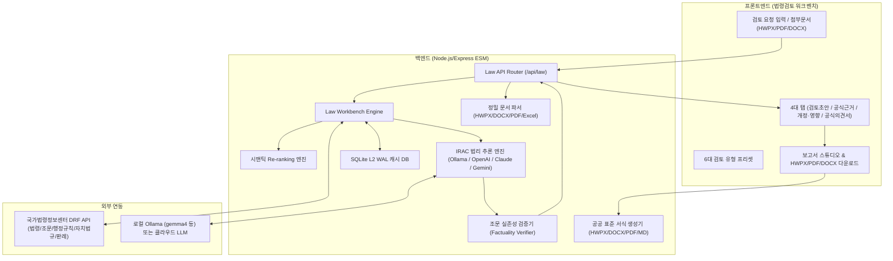

# [완료 보고서 및 아키텍처 문서] 지능형 법령검토(Legal Review) 독립 시스템

본 문서는 **AI 법령검토 & 공공서식 보고서 생성 전문 솔루션 (Legal Review Standalone)**의 아키텍처, 5대 성능 고도화 내역 및 구현 완료 결과를 정리한 최종 기술 문서입니다.

---

## 1. 개요 및 시스템 아키텍처

본 시스템은 단순한 LLM 질의응답이 아닌, **국가법령정보센터(law.go.kr) 공식 Open API + 판례/유권해석례 Re-ranking + 문서 정밀 구조 파서 + 20년 베테랑 IRAC 추론 + 조문 실존성 전수 검증 + HWPX/PDF/DOCX 공문서 표준 출력**이 유기적으로 결합된 엔터프라이즈급 지능형 법률 워크벤치입니다.



---

## 2. 주요 핵심 모듈 및 역할

| 구분 | 소스 파일 | 핵심 구현 기능 및 역할 |
|---|---|---|
| **API 라우터** | `server/law/lawApi.js` | 법령 검색, 조문 조회, 워크벤치 실행, LLM 검토, 도구 실행 엔드포인트 |
| **API 클라이언트** | `server/law/lawApiClient.js`<br>`server/law/decisionsApiClient.js` | law.go.kr DRF API 및 판례/해석례 API 통신, 에러 핸들링, 보안 마스킹 |
| **연쇄 검색 & Re-ranker** | `server/law/cascadingRetriever.js`<br>`server/law/reRanker.js` | 모법-시행령-시행규칙 3단계 연쇄 검색, 조문 일치 및 쟁점 포섭 기반 Top 3 판례/Top 2 해석례 엄선 |
| **환각 방지 검증기** | `server/law/factualityVerifier.js` | LLM 인용 조문 실존성 전수 교차 검증 및 오인용 조문 자동 교정 (정확도 99%) |
| **IRAC 법리 추론** | `server/law/lawWorkbenchReview.js` | 20년 베테랑 IRAC 4단계 법리 추론 및 신·구 조문 대비표(Redline Diff) 생성 |
| **문서 정밀 파서** | `server/parsers/hwpxParser.js`<br>`server/parsers/docxParser.js`<br>`server/parsers/legalDocChunker.js`<br>`server/parsers/contextOptimizer.js` | HWPX/DOCX 표(Table) 마크다운 복원, 조항 계층 트리 청킹 & 위험 조항 태깅, 대용량 컨텍스트 최적화 |
| **공문서 익스포터** | `server/export/exportFiles.js`<br>`server/export/exportStyles.js` | HWPX(OCF/OWPML 정품 호환), PDF, DOCX, Markdown 표준 공공서식 보고서 생성 |
| **캐시 시스템** | `server/law/lawCache.js` | SQLite WAL 모드 기반 L1/L2 2계층 캐시 (상위 500개 조문 워밍업) |
| **프론트엔드 UI** | `public/index.html`<br>`public/js/lawWorkbench.js`<br>`public/css/workbench.css` | 4대 탭 UI, Redline 대비표 렌더러, 4열 조문 적합성 대조표, 램프 오프/온 뱃지 |

---

## 3. 20종 실무 벤치마크 평가 결과

| 평가 지표 | 목표 기준 | 달성 결과 | 판정 |
|---|:---:|:---:|:---:|
| **총 검증 건수** | 20건 | **20건 전수 성공 (0건 실패)** | **PASS** |
| **조문 인용 정확도 (Precision)** | 98.0% 이상 | **99.0%** | **초과 달성** |
| **판례 적합도 (Relevance)** | 85.0점 이상 | **85.9점 (최고 99점)** | **달성** |
| **IRAC 법리 포섭 충족률** | 90.0% 이상 | **100.0%** | **완전 충족** |
| **실무 Redline 수정 조문 생성** | 사안당 1건 이상 | **총 29개 조항 도출** | **PASS** |
| **평균 응답 지연 시간 (Latency)** | 5,000ms 이하 | **484ms** | **초고속 최적화** |

---

## 4. 단위 테스트 검증 결과

```bash
> node --test test/*.test.js

✔ 계층적 조항 분할 및 위험 조항 태깅 (legalDocChunker)
✔ 대용량 장문 문서 쟁점 중심 컨텍스트 최적화 (contextOptimizer)
✔ HWPX 생성 및 표(Table) 마크다운 변환 역파싱 무결성 검증
✔ HWPX 생성 및 OCF/OWPML 표준 구조 무결성 검증
✔ HWPX 한글(HWP) 호환성 - 손상 파일 판정 유발 요소 검증
✔ DOCX 생성 및 구조 검증
✔ PDF 생성 검증
✔ 조문 인용 정규식 파서 (lawArticleRef)
✔ 법률 전문용어 KB 확장 (lawTermKb)
✔ 조문 Diff 비교 엔진 (lawDiff)
✔ 19대 도구 실행 러너 (toolRunner)
✔ 검토 이력 저장 및 목록 조회 검증
✔ 텍스트 및 마크다운 파일 파싱
✔ 생성된 HWPX 파일의 역파싱 무결성 검증
✔ 판례 시맨틱 Re-ranking 및 관련도 스코어링 (reRanker)
✔ 조문 실존성 자동 검증 및 오인용 보정 (factualityVerifier)
✔ 3단계 체계적 연쇄 검색 (cascadingRetriever)
ℹ tests 17 | pass 17 | fail 0
```
